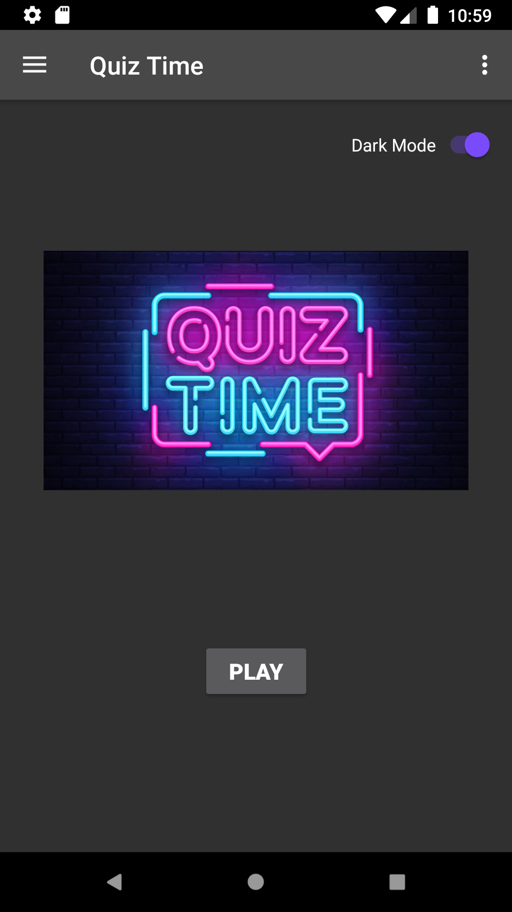

# Quiz_Time
## Introduction

This is a app-cum-game meant to increase and test your overall knowledge about World, general knowledge of Animals, Birds and Science,
Current Affairs and overall Aptitude.

This Android App is build in Android Studio. It makes use of the navigation component within Jetpack to move the user between screens. Each screen is implemented as a fragment.The app navigates using buttons, the app bar, and a navigation drawer.

This App has two modes: Light and Dark. Light is the default mode. Users can shift to Dark mode by clicking switch button on the title screen.

Right-To-Left languages are also supported by this app. No changes are to be made in order to support RTL languages.

After Completing the game, users can share success via clients of sharing installed on the respective devices. In order to give feedback or sharing success with developer, Users can "Share Success" using E-mail only.

## Package Download
This android app is available in apk format. [Download here](https://drive.google.com/file/d/1gpru6JNViFBwog1HBVZ6dka7PU3tmwda/view?usp=sharing)

## Screenshots

</img>
</img>
</img>
</img>
</img>
</img>
</img>
</img>
</img>

